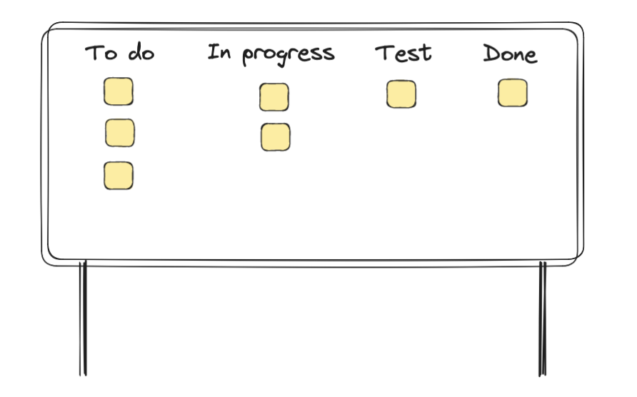
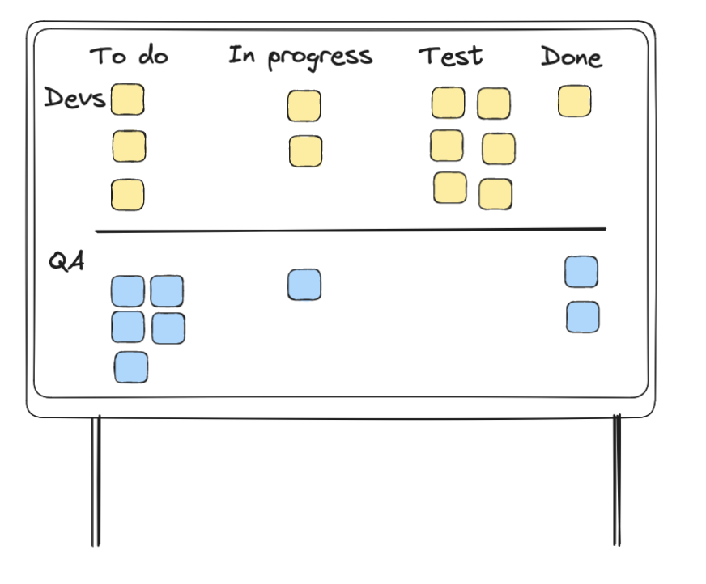
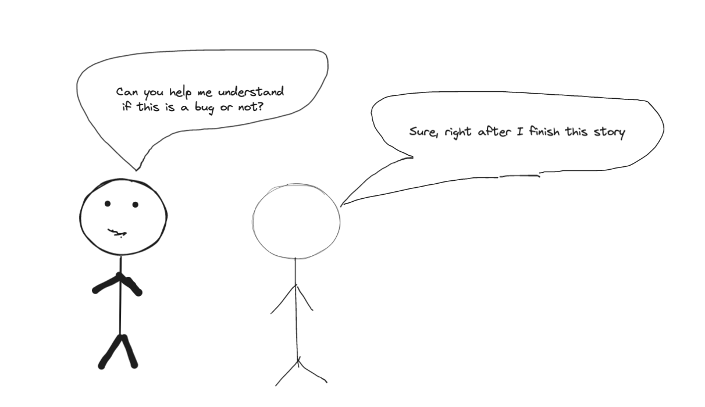

Samuel was driving to work, still sleepy and not in a very good mood. It was a sunny morning, a beautiful sky, but not even that could reduce the anxiety he was feeling. The last release went wrong, some issue with the back office features was preventing the partners from publishing ads and affecting not only their sales but also their relationship with partners. He always understood the importance of quality in software and how it impacts customer attrition and brand reputation. 

While waiting for the green light, his thoughts went to when he started working. He started in a small company that did software business. They didn’t have a QA process. When he suggested a dedicated person to do QA, his boss mocked him: “One person to just do tests? Are you serious? I think you can do it because the effort is not that much, just a few clicks.” This statement stayed with him for the rest of his career until this day. While he was thinking about it, he was considering his previous boss's perspective. It wasn’t entirely wrong, but not right either. 

## The first company

His thoughts were still at that company. What had gone so wrong with the quality? Good engineers were working for them, management wasn’t completely bad, and had some good previous experience in successful companies, why didn’t they succeed at quality? 

They were creating a new version of the product from scratch, which was common practice for companies at the time. They worked for months on the requirements and planning. Everything was perfect - it wasn’t but project management is not the focus here. When they started to have customers using the beta version of the software, the number of issues was so high that they spent more time trying to fix things than finishing the project. They didn’t have any quality process in place, the process was changing the code and pushing it to production, sometimes even during a call with the customer. 

Living this reality makes people more sensible about the quality topic. He didn’t want to spend more time trying to fix issues in production than adding value to the customer. 

## Back to thrownewexception.com — how it started

From the very beginning he joined the company, he insisted on having quality assurance. They started an area that was dedicated to making sure the software had the right quality for the customer. They hired a first QA, and it was amazing the amount of bugs found. Even in production. 

Samuel was entering the building and greeting people while thinking about it and noticing how much everything had changed. Without noticing he was smiling near the coffee machine, remembering the dynamic change that happened with the first QA engineer at the company finding bugs and the reaction of the other engineers. Engineers were not used to that interaction, but luckily they had found a QA with good soft skills that could relate well to them and soften the situation. The other engineers used to make jokes using Schrödinger's cat analogy, saying that the QA created the bug by opening the box.

The quality process at the time was done at the end of the project. The team(s) built the feature(s) and then QA would understand the requirements, create some user acceptance testing, and validate if the software was ready for release. It was slightly agile because the engineers were ready to help the QA team document the user acceptance testing and fix the issues they found. The collaboration was good.

## thrownewexception.com—Adopting SCRUM

The teams started adopting SCRUM to manage their work and one of the first challenges was how to coordinate the QA work with the Devs’ work. It was decided to add a stage on the scrum board, called “Test”. The developer would write the code, and after it was ready the card was moved to the “Test” column and the QA would validate if the feature was correctly implemented.

<em>Figure 1 - The process</em>

After a while—not long, actually—we started noticing that the QA was without much work to do at the start of the sprint and then, when the end of the sprint approached, they had a lot of tasks to validate and more often than not, the team would miss the sprint goals because it was unable to validate all the tasks. 

## thrownewexception.com — Quality week 💡

After some consideration, the leadership decided to have the QA perform the validation of the items from the previous sprint in the first week of the sprint. 

<em>Figure 2 - The QA with a different stream
  than the devs</em>

It means the QA has a different stream from the devs during one week. When some items were in Test at the end of the sprint, the QA would replicate that to the QA Stream and ensure it got validated in the right order. After all the items from the sprint were validated, the team would release the product to the client.

This solved the issue of putting too much pressure on the QA at the end of the sprint, but the overall speed and throughput of the team didn’t improve. In fact, Hannah, the scrum master, showed that the speed was declining. “The reason for this trend may be explained by the need to go back and fix bugs. The team has too much context switch, and it may be impacting the speed.” —said Hannah. She continued, “I’d suggest trying to have a releasable product by the end of the sprint instead. Maybe we can keep the two weeks sprint, but have one week to work and another week to stabilize the product to release it”. We adopted Hannah’s suggestion.

The amount of work the team committed to at the beginning of the sprint was reduced, and it helped complete everything during the sprint. But the feeling was that we had a “small waterfall”, where the developers spend a week writing code and the QA spends the next week testing it. The team got more consistent in the amount of stories delivered, but the process wasn’t the best. 

## thrownewexception.com — Mindset

The QA was considered to be the person that would approve the change. A quality gate. The expectation of having one QA validating the work of four or more developers was too optimistic. If the goal was to achieve the sprint goal, wouldn’t it be better to leverage the entire team?

After a long and, sometimes stressful session of retrospective and brainstorming, the team decided it would make sense to change the mindset. The QA can’t be the “sole responsible for the quality” said an engineer “We must all take responsibility for it”. **Shared responsibility** was the concept of the day and, after that session, any member of the team would be ready to pick up the task in the test column and validate if it was working correctly.

But Julia, the QA, was confused. “How will the team know what to test?”. Excellent question. 

<em>Figure 3 - QA trying to get help from Devs focused on their sprint</em>

## thrownewexception.com — Today

Weeks went by and Julia approached Enzo in the coffee machine. “I’m loving this new way of working. I have much more time to do other things that have much more impact than validating each story individually. I feel like a partner for the developers instead of validating their work and I can work closely with the product team to understand the clients, help them anticipate risks, and explore our product in production”. 

Enzo was tremendously happy to hear that, but then he asked her: “Are you aware of the incident we had in our last release? What could we have done to avoid it?”

Julia told him it was a mistake following the regression testing procedure, a validation was missed, and it led to an issue going to production that affected our clients.

“What can we do to prevent it?” — asked Enzo.

“Well, I have an idea. Have you heard about testing automation?”

## thrownewexception.com — Automation 🤖

“With automation, we can release our product to our clients immediately with confidence”—said Julia to the team, — “And we can even validate some parts in production.”.

## Conclusion

“Asking Julia to validate quality at the end of the sprint is like asking to validate we had good quality construction materials after building the house. Wouldn’t it be better aiming to prevent defects before they happen?”

As our industry evolved, our approach to quality also evolved. In the past, it was expected after an engineer finished their work to deploy the changes in an environment, update the card in JIRA, and wait for the QA to validate its changes or return the ticket with bugs. More often than not, the QA would have some doubts and ask the engineer about it before opening a bug to be fixed—or return the ticket with these issues. If the process doesn’t feel very different from what you are used to, don’t worry, a lot of companies still do software development like this. But for the most innovative tech companies, a process like this is long gone. 

#### Why?

This process's biggest challenge is preventing a bottleneck without hiring more QA to do the job.

> The first thing we did was make QA part of engineering. In the “old world”, an engineer would finish their work, check into their branch, update a ticket, and let the QA know it was ready for review. The QA would take this ticket a day or two later, review it, and reopen the ticket if they found issues. This was a long delay.

> We made a quiet, unofficial, change where all SDETs built production software as well, and all software engineers became responsible for testing their own code. Now we no longer had to wait days for feedback before shipping the code to production. However, the bi-weekly sprints and the numerous Scrum rituals became the next problem.

These quotes are from [this amazing](https://blog.pragmaticengineer.com/project-management-at-big-tech/) article authored by **Gergely Orosz**. This story is already long enough, but if you want to get insights from within those companies, read the article from Gergely Orosz.
