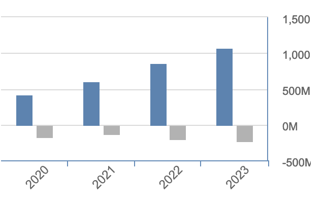

First things first, the title is from the amazing joke Erik Bjäreholt did on X (ex-twitter). 

  <blockquote class="twitter-tweet" data-dnt="true">
    
Redis is no longer open source? I guess they gave up on their key values 🥁

    &mdash; Erik Bjäreholt (@ErikBjare) 
    <a href="https://twitter.com/ErikBjare/status/1771474971564318842?ref_src=twsrc%5Etfw">March 23, 2024</a>
  </blockquote>
   

So, Redis adopts dual source-available licensing. But what does it mean?

We all know that we can use Redis on AWS, Azure, and Google Cloud. Probably in different clouds as well, but I’m talking about “real” clouds – just kidding Oracle, please don’t sue me. 

This is convenient for us, the users, but not so much for the company, or at least, the company doesn’t think it’s good for them. As a result, companies with open-source products, look for alternatives to protect their IP from being monetized by big cloud providers. 

A typical move is to move their license to a dual source-available license. [Elasticsearch](https://www.elastic.co/pricing/faq/licensing) did it in the past, and now it’s Redis’ turn to do the same. But what is dual source-available licensing? Dual source-available licensing typically means that it is released under two different licenses, one of which is an open-source license and the other is a proprietary or more restrictive license. 

One question I asked on X was how did it affect the revenue and customers. 

  <blockquote class="twitter-tweet" data-dnt="true">
  
Redis adopts dual source-available licensing. 
        Is there any public available research to understand the impact in the revenue of the company that made these decisions in the past? Did it increase or decrease?
        And how about the providers? Did the cost move to the clients?
    
&mdash; Bruno Costa (@brunomvpcosta) 
    <a href="https://twitter.com/brunomvpcosta/status/1770788756104036617?ref_src=twsrc%5Etfw">March 21, 2024</a>
  </blockquote>

While we can’t say anything about Redis Labs yet, we can look at MongoDB and Elasticsearch to understand the revenue impact.

### Elasticsearch

January 2021, Elasticsearch [announced](https://www.elastic.co/blog/why-license-change-aws) that the license would be moving from the Apache 2.0-licensed source code to be dual licensed under both the Elastic License and SSPL. 

Did it impact their revenue? If we look at their [balance sheet](https://www.investing.com/equities/elastic-financial-summary) we can see they continued to grow their revenue from 2021 ($608M) until 2023 (1.07B). 

The revenue doesn’t seem to have been impacted.

Did it affect customers? It is not easy to evaluate it without deeper investigation, but it seems AWS and Elasticsearch had their disagreements regarding the technology, but eventually, they [reached an agreement](https://www.elastic.co/blog/elastic-and-amazon-reach-agreement-on-trademark-infringement-lawsuit). That means that customers using AWS to use Elasticsearch are in fact using Elastic Cloud – customers can choose to use OpenSearch from AWS which is a fork from the Elasticsearch codebase. From what I could gather from the Elasticsearch [forum](https://discuss.elastic.co/t/difference-between-using-elastic-cloud-aws-and-using-elastic-from-aws-marketplace/320898/2) there is no difference between using the Elastic Cloud directly or using it through the AWS marketplace.

### MongoDB

In 2018, [MongoDB changed its license to Server Side Public License](https://www.mongodb.com/legal/licensing/server-side-public-license) to prevent the same issue as Elasticsearch. They had multiple providers in Asia leveraging their technology to provide MongoDB as a service, but without contributing back to the community.

Back then, their revenue was $115M, and fast-forward to 2023, their [revenue](https://www.macrotrends.net/stocks/charts/MDB/mongodb/revenue) is now $1,284B.

The business model is very similar to Elasticsearch, they have a cloud offer where they offer MongoDB-as-a-service. Cloud providers like AWS have their “API-compatible” MongoDB alternative, but MongoDB revenue is still growing YoY.

## Conclusion
The change appears to be good for companies, without really impacting customers. Perhaps we are witnessing the transformation of open-source businesses adapting to the AWS business model of taking advantage of their goodwill.
